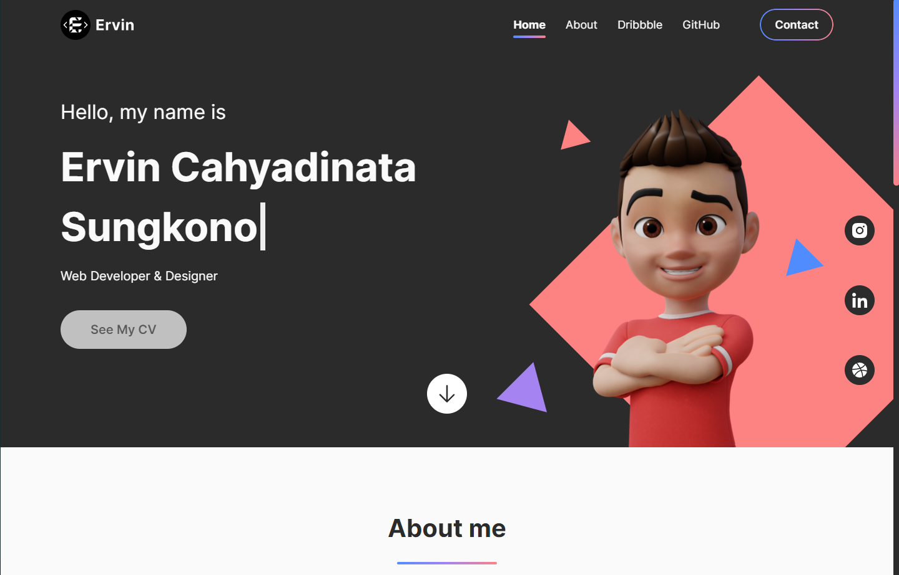

# Portofolio-Website
Website that i built using HTML,CSS, and JS to showcase my projects and designs. This project also uses Jribbble library.

## Features
1. Direction Aware Card Hover
2. Scroll Events
3. Responsive Layout
4. Dribbble API to show designs
5. Github API to show projects

### Preview Image

[Click here](https://ervin-sungkono.github.io) to see the website!